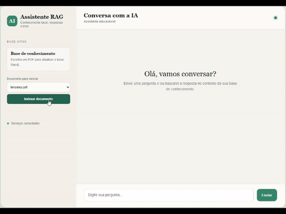

# Chat RAG com PHP, Qdrant e OpenAI

Aplicação PHP para conversar com documentos PDF indexados no Qdrant e gerar respostas usando a API da OpenAI. A interface web permite selecionar um documento, indexá-lo e fazer perguntas limitadas ao arquivo selecionado.

## Funcionalidades

- Interface de chat responsiva em formato de conversa.
- Seleção de PDFs disponíveis em `documents/`.
- Indexação incremental: documentos novos são adicionados sem apagar os anteriores.
- Verificação para evitar indexação duplicada do mesmo arquivo.
- Busca limitada ao `source` do documento selecionado.
- Recuperação semântica dos chunks usando embeddings e similaridade de cosseno.
- Respostas em streaming via SSE, quando o servidor permite entrega incremental.
- Exibição da fonte utilizada e dos tokens de entrada e saída informados pela OpenAI.
- Cache local de respostas com Redis opcional e fallback para arquivos.

## Requisitos

- PHP 7.4 ou superior.
- Extensões PHP `curl` e `json`.
- Composer.
- Qdrant em execução e acessível via REST.
- Redis em execução, somente se o cache Redis for utilizado.
- Uma chave de API da OpenAI.
- Um modelo disponível na OpenAI, como o definido em `OPENAI_MODEL`.
- Um bundle de certificados CA quando o PHP no Windows não possuir uma CA configurada.

## Estrutura

```text
.
├── index.php                 # Interface web e JavaScript do chat
├── buscar.php                # API POST para perguntas e indexação
├── documents/                # PDFs disponíveis para indexação
├── prompts/                  # Prompt e template enviados à OpenAI
├── src/
│   ├── AI.php                # Pipeline de recuperação e resposta
│   ├── Cache.php             # Cache local de respostas (Redis ou arquivos)
│   ├── Config.php            # Configurações do projeto
│   ├── DocumentProcessor.php # Extração e divisão de PDFs
│   ├── Embeddings.php        # Geração atual de vetores de demonstração
│   ├── QdrantVectorStore.php  # Persistência e recuperação no Qdrant
│   └── OpenAI.php             # Integração normal e streaming com OpenAI
├── composer.json
├── composer.lock
├── video.mp4                 # Demonstração da aplicação
├── video.gif                 # Demonstração animada
├── .env.example
└── .gitignore
```

## Configuração

Copie o arquivo de exemplo e ajuste as variáveis:

```powershell
Copy-Item .env.example .env
```

Principais variáveis:

```dotenv
OPENAI_API_URL=https://api.openai.com/v1
OPENAI_API_KEY=your-openai-api-key
OPENAI_MODEL=gpt-4o-mini
OPENAI_MAX_OUTPUT_TOKENS=350
OPENAI_MAX_RETRIES=1
# Opcional no Windows: caminho para cacert.pem
OPENAI_CA_BUNDLE=C:\wamp64\apps\phpmyadmin5.2.3\vendor\composer\ca-bundle\res\cacert.pem
QDRANT_URL=http://127.0.0.1:6333
QDRANT_API_KEY=
QDRANT_COLLECTION=rag_documents
# Opcional: deixe REDIS_HOST vazio para usar cache em arquivos em cache/.
REDIS_HOST=
REDIS_PORT=6379
REDIS_PASSWORD=
OPENAI_EMBEDDING_MODEL=text-embedding-3-small
MAX_CHUNK_SIZE=500
CHUNK_SIZE=1000
CHUNK_OVERLAP=200
SIMILARITY_TOP_K=3
MIN_SIMILARITY_SCORE=0.15
```

`MAX_CHUNK_SIZE` define o tamanho máximo de cada chunk de documento, em caracteres. O valor padrão é `500`.

`CHUNK_SIZE` e `CHUNK_OVERLAP` controlam o tamanho alvo de cada chunk e a sobreposição entre chunks consecutivos, em caracteres (padrão `1000`/`200`). `MAX_CHUNK_SIZE` só reduz esse limite quando definido com um valor menor que `CHUNK_SIZE`.

`SIMILARITY_TOP_K` define quantos trechos mais relevantes são buscados no Qdrant (padrão `3`). `MIN_SIMILARITY_SCORE` descarta trechos cujo score de similaridade fique abaixo do valor informado (padrão `0.15`). Scores de cosine com embeddings da OpenAI costumam ficar entre `0.2` e `0.4` para trechos relevantes nesta base; valores como `0.5` descartam resultados válidos.

`OPENAI_MAX_OUTPUT_TOKENS` limita tecnicamente os tokens produzidos em cada resposta. `OPENAI_MAX_RETRIES` limita novas tentativas após falha; ambos reduzem o risco de custo inesperado.

O arquivo `.env` é carregado automaticamente por `src/Config.php`. Variáveis já definidas no ambiente têm prioridade sobre os valores do arquivo.

### Certificado TLS no Windows

Se o PHP retornar `unable to get local issuer certificate`, configure `OPENAI_CA_BUNDLE` apontando para um arquivo `cacert.pem` confiável. Em instalações WampServer que já possuem o phpMyAdmin, este arquivo pode estar em:

```text
C:\wamp64\apps\phpmyadmin5.2.3\vendor\composer\ca-bundle\res\cacert.pem
```

Mantenha a validação SSL habilitada. Não use `CURLOPT_SSL_VERIFYPEER=false` como solução.

Instale as dependências:

```powershell
composer install
```

### Cache local

As respostas são armazenadas por uma chave derivada da pergunta e do documento selecionado, com TTL de uma hora. Uma resposta encontrada no cache não consulta o Qdrant nem chama a OpenAI. O mesmo comportamento vale para requisições com streaming SSE.

O embedding de cada pergunta também é cacheado (TTL de 24 horas), evitando chamar a OpenAI novamente para perguntas repetidas mesmo quando a resposta final não estiver em cache.

Por padrão, deixe `REDIS_HOST` vazio. O projeto gravará arquivos serializados em `cache/`, diretório criado automaticamente e ignorado pelo Git.

Para compartilhar o cache entre processos ou servidores, configure um Redis e preencha as variáveis abaixo no `.env`:

```dotenv
REDIS_HOST=127.0.0.1
REDIS_PORT=6379
# Deixe vazio quando o Redis não exigir autenticação.
REDIS_PASSWORD=
```

O cliente Redis é fornecido por `predis/predis`. Para iniciar um Redis local com Docker:

```powershell
docker run --name rag-redis -d -p 6379:6379 redis:7-alpine
```

Não configure `REDIS_HOST` se o Redis não estiver acessível; caso contrário, o cliente tentará usá-lo em vez do fallback por arquivos.

O arquivo `.env` contém credenciais locais e está ignorado pelo Git. Não o publique.

Nunca coloque a chave da API no `README.md`, no código-fonte ou em um commit. Se ela for exposta, revogue-a na OpenAI e gere outra.

## Demonstração



<video src="./video.mp4" controls width="800">
	Seu navegador não oferece reprodução de vídeo. [Abra o vídeo](./video.mp4).
</video>

[Baixar ou abrir a demonstração em vídeo](./video.mp4)

## Executar o chat

Na raiz do projeto, inicie o servidor PHP:

```powershell
php -S 127.0.0.1:8091 -t .
```

Abra no navegador:

```text
http://127.0.0.1:8091/index.php
```

Selecione um PDF em `documents/` e clique em **Indexar documento**. Depois, mantenha esse documento selecionado para fazer perguntas. A API usada pelo navegador é `buscar.php`.

## Qdrant no navegador

Com o serviço iniciado por `docker compose up -d`, use os endereços abaixo:

- Dashboard: http://127.0.0.1:6333/dashboard
- API e lista de coleções: http://127.0.0.1:6333/collections
- Coleção padrão: http://127.0.0.1:6333/dashboard#/collections/rag_documents

## Fluxo de indexação

1. O PHP extrai o texto do PDF com `smalot/pdfparser`.
2. O texto é dividido em chunks.
3. Cada chunk é salvo no Qdrant com `content`, `source`, `chunk` e `embedding`.
4. Se já existir um chunk com o mesmo `source`, a indexação é ignorada.
5. Documentos diferentes permanecem na mesma base, sem exclusão automática.

## Fluxo de perguntas

1. O navegador envia `question` e `document` para `buscar.php`.
2. A consulta Qdrant gera o embedding da pergunta e filtra os pontos pelo arquivo selecionado.
3. O Qdrant ordena os chunks por similaridade de cosseno.
4. Os chunks relevantes são inseridos no marcador `{context}` do template.
5. O prompt é enviado à OpenAI usando o endpoint Responses API.
6. Antes de consultar o Qdrant, a aplicação procura uma resposta no cache local usando a pergunta e o documento.
7. Em caso de cache miss, a resposta é entregue por streaming, armazenada por uma hora e a interface exibe fonte e uso de tokens ao final.

As chamadas de resposta usam `https://api.openai.com/v1/responses`, com `input`, `model` e `temperature`. O modo de streaming processa eventos SSE da Responses API. Os embeddings usam `https://api.openai.com/v1/embeddings` e o modelo `text-embedding-3-small`.

## Limitações atuais

- `src/Embeddings.php` usa o modelo `text-embedding-3-small` da OpenAI, que gera vetores de 1536 dimensões.
- A coleção Qdrant é criada automaticamente com a dimensão do primeiro embedding indexado.
- A extração de PDFs depende da qualidade do texto interno do arquivo. PDFs escaneados podem exigir OCR.
- O streaming depende de o servidor web não agrupar ou comprimir a resposta SSE.
- O `src/index.php` é um script de teste/execução em terminal e possui fluxo separado da interface web.

## Diagnóstico rápido

Verifique a sintaxe dos arquivos principais:

```powershell
php -l index.php
php -l buscar.php
php -l src/AI.php
php -l src/QdrantVectorStore.php
php -l src/OpenAI.php
```

Se o chat não responder, valide a sintaxe e confirme, nesta ordem:

1. `OPENAI_API_KEY` está preenchida e ainda é válida.
2. `OPENAI_MODEL` corresponde a um modelo disponível na sua conta OpenAI.
3. `OPENAI_CA_BUNDLE` aponta para um arquivo existente quando o PHP indicar erro de certificado.
4. Qdrant está em execução e acessível em `QDRANT_URL`.

```powershell
Get-Content .env | Select-String OPENAI
```

Para testar somente a conexão com a OpenAI, sem depender do Qdrant, execute:

```powershell
php -r "require 'src/Config.php'; require 'src/OpenAI.php'; Config::load(); `$result = (new OpenAI(Config::`$openai))->invoke('Responda apenas com OK.'); echo `$result['response'], PHP_EOL;"
```

## Licença

MIT